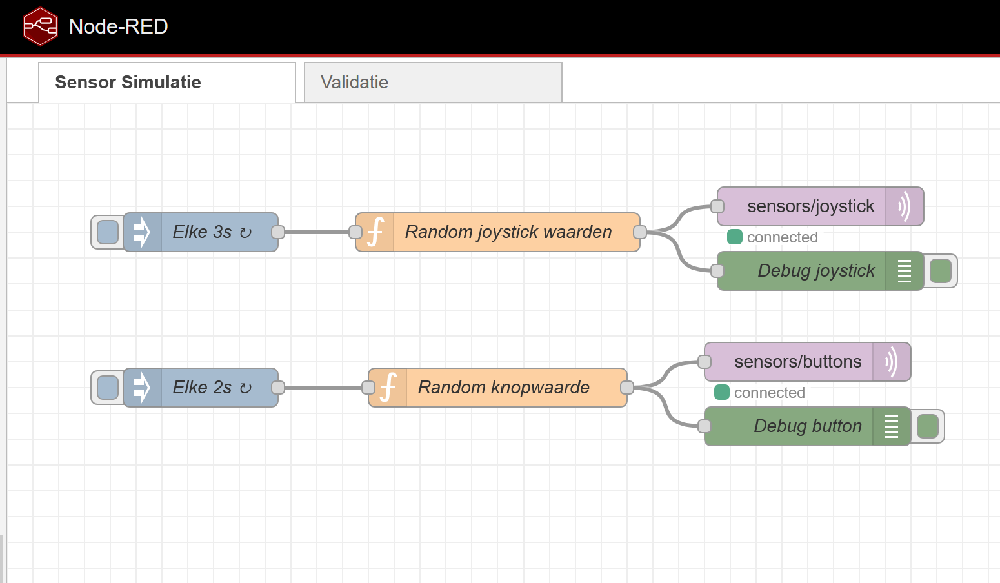
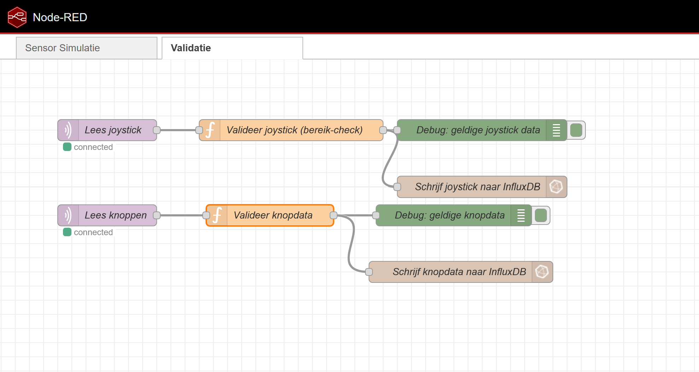
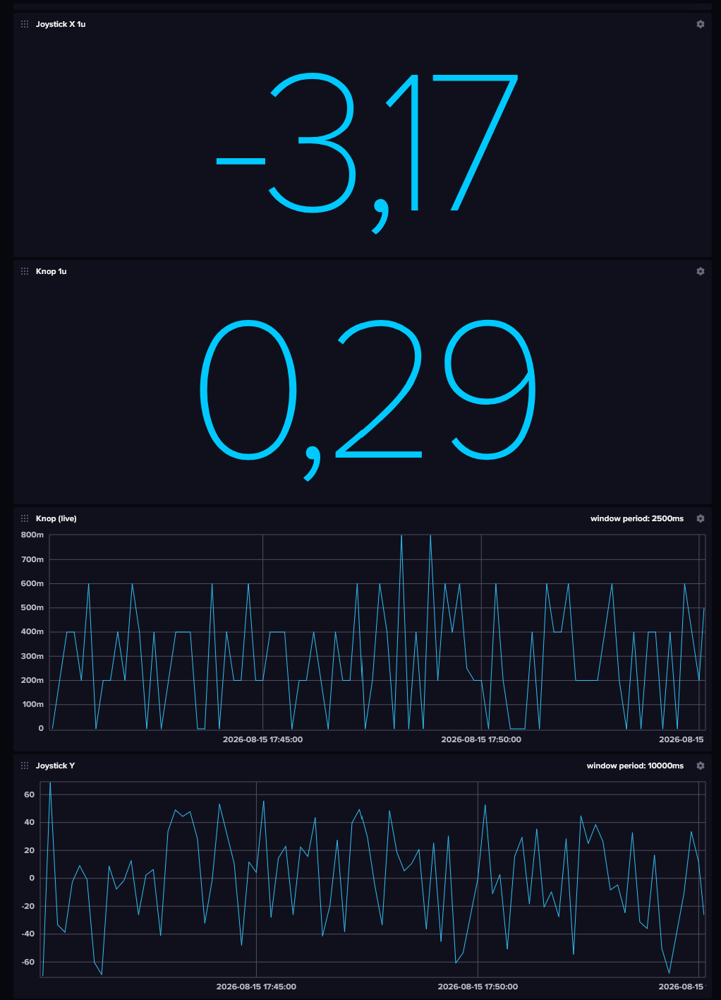
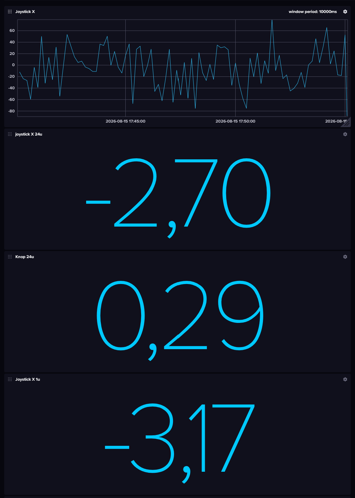
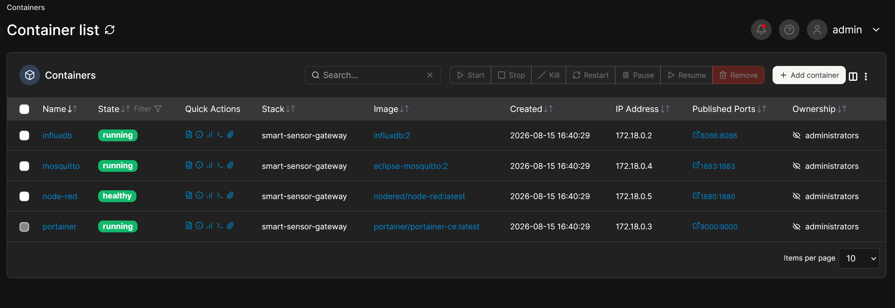

# Smart Sensor Gateway met monitoring en automatisatie

Cloud computing opdracht — Bachelor Elektronica-ICT, VIVES Hogeschool
Academiejaar 2025-2026

**Student:** Jarne Boodts (individueel uitgevoerd)

## Architectuur

Een sensor-simulatie (Node-RED) publiceert joystick- en knopwaarden via MQTT naar een Mosquitto-broker. Een tweede Node-RED-flow leest deze data in, valideert ze, en schrijft enkel geldige metingen weg naar InfluxDB. Vanuit InfluxDB wordt de data getoond in een dashboard. Alle services draaien in Docker-containers, beheerd via Portainer.

| Service | Rol | Poort |
|---|---|---|
| Mosquitto | MQTT-broker | 1883 |
| Node-RED | Sensor-simulatie + datavalidatie | 1880 |
| InfluxDB | Tijdreeksdatabase + dashboard | 8086 |
| Portainer | Monitoring/beheer containers | 9000 |

## Sensorcommunicatie (MQTT)

Twee topics:
- `sensors/joystick` — `joystick_x`, `joystick_y` (-100 tot 100), elke 3s
- `sensors/buttons` — `button_pressed` (boolean), elke 2s

## Verwerking van data (Node-RED)

De flow "Validatie" leest beide topics in via `mqtt in`-nodes en valideert de data in zelfgeschreven function nodes:
- Joystick: controleert of `joystick_x`/`joystick_y` numeriek en binnen [-100, 100] liggen. Ongeldige data wordt genegeerd.
- Knop: controleert of `button_pressed` een boolean is, en berekent `button_pressed_numeric` (0/1) — nodig omdat InfluxDB geen gemiddelde kan berekenen over booleans.

Enkel gevalideerde data gaat naar InfluxDB.




## Opslag en visualisatie

Gevalideerde data wordt weggeschreven in InfluxDB (bucket `sensors`), measurements `joystick_data` en `button_data`. Het dashboard toont live waarden en gemiddelden over 1u en 24u.




## Containerisatie

Alle services draaien via `docker-compose.yml` op een gedeeld Docker-netwerk (`gateway-net`), elk met een eigen volume voor persistente data.

## Monitoring (Portainer)



## Automatisatie (Docker Compose)

```bash
docker compose up -d
```

Start de volledige stack (Mosquitto, Node-RED, InfluxDB, Portainer) met één commando.

## CI/CD

`deploy.sh` stopt de bestaande containers, haalt de nieuwste images opnieuw op, en herstart de stack:

```bash
chmod +x deploy.sh
./deploy.sh
```

In een echte pipeline zou dit script getriggerd worden bij elke push naar `main` (bv. via GitHub Actions die inlogt op de doelserver en het script uitvoert). Hier wordt dat manueel gedemonstreerd, met hetzelfde resultaat: stoppen → updaten → herstarten.

## Installatie

```bash
git clone https://github.com/JarneBoodts/smart-sensor-gateway.git
cd smart-sensor-gateway
docker compose up -d
```

- Node-RED: http://localhost:1880
- InfluxDB: http://localhost:8086 (admin / adminpassword)
- Portainer: http://localhost:9000 (account aanmaken bij eerste bezoek)

Voor de InfluxDB-koppeling in Node-RED moet éénmalig een API-token aangemaakt worden in InfluxDB en ingevuld worden in de `influxdb out`-nodes.

## Beveiliging

- Mosquitto draait met `allow_anonymous true` voor eenvoud tijdens ontwikkeling; voor productie zou authenticatie/TLS nodig zijn.
- Het InfluxDB API-token staat enkel in Node-RED's versleutelde credentials-opslag en wordt via `.gitignore` uitgesloten van Git.

## Reflectie

Dit project werd individueel uitgevoerd. Dat maakte het pittiger dan verwacht, aangezien alle onderdelen door mij opgezet en getest moesten worden zonder werk te kunnen verdelen. Door er voldoende tijd voor vrij te maken en te focussen, is het uiteindelijk toch gelukt om het project volledig af te werken.

## Versiebeheer

https://github.com/JarneBoodts/smart-sensor-gateway

`node-red-data/`, `influxdb-data/`, `portainer-data/`, `mosquitto/data/`, `mosquitto/log/` en `.env` zijn uitgesloten via `.gitignore`.
